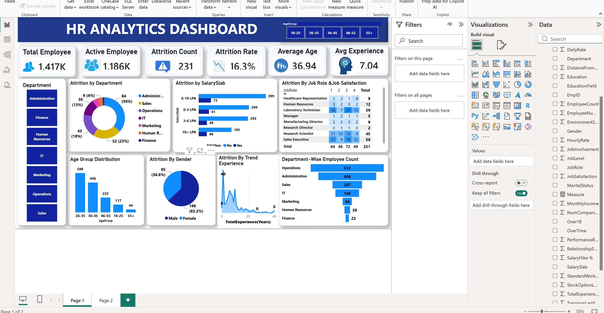

# 📊 HR Analytics Dashboard | Power BI

An interactive **HR Analytics Dashboard** developed using **Microsoft Power BI** to analyze workforce data, employee attrition, department performance, demographics, and key HR metrics. This dashboard helps HR professionals make data-driven decisions through interactive reports and visualizations.

---

## 📌 Project Overview

The **HR Analytics Dashboard** provides valuable insights into employee data, enabling organizations to monitor workforce trends, identify attrition patterns, evaluate employee demographics, and improve HR decision-making.

---

## 🚀 Key Features

- 👨‍💼 Employee Overview
- 📉 Attrition Analysis
- 🏢 Department-wise Employee Distribution
- 👥 Gender Distribution
- 🎓 Education Analysis
- 💼 Job Role Analysis
- 📊 KPI Cards
- 📈 Interactive Charts
- 🎛 Dynamic Filters & Slicers

---

## 🛠️ Tools & Technologies

- Microsoft Power BI
- Microsoft Excel
- Power Query
- DAX (Data Analysis Expressions)

---

## 📷 Dashboard Preview

> Upload your dashboard screenshot as **Dashboard.png**.



---

## 📂 Repository Structure

```text
HR-Analytics-Dashboard/
│
├── HR Analytics Dashboard.pbix
├── HR_Analytics_Dataset.xlsx
├── Dashboard.png
├── README.md
└── LICENSE
```

---

## 📊 Dashboard Insights

This dashboard provides insights into:

- Total Employees
- Employee Attrition
- Attrition Rate
- Active Employees
- Department-wise Employees
- Gender Distribution
- Education Field Analysis
- Job Role Analysis
- Employee Age Distribution

---

## 💡 Business Benefits

- Monitor employee attrition trends
- Analyze workforce demographics
- Support HR decision-making
- Improve employee retention strategies
- Identify department-wise workforce performance

---

## ▶️ How to Use

1. Clone or download this repository.
2. Open **HR Analytics Dashboard.pbix** using Microsoft Power BI Desktop.
3. Refresh the dataset if required.
4. Explore the dashboard using interactive filters and visuals.

---

## 💼 Skills Demonstrated

- Data Visualization
- HR Analytics
- Dashboard Development
- Business Intelligence
- Power Query
- DAX
- KPI Reporting
- Data Analysis

---

## 📧 Connect With Me

**Jitendra Kumar Sharma**

🎓 B.Tech (Artificial Intelligence & Data Science)

📊 Aspiring Data Analyst | Power BI Developer

- 💻 GitHub: https://github.com/jitendra-sharmas
- 💼 LinkedIn: https://www.linkedin.com/in/jitendra-sharmas/

---

## ⭐ Support

If you found this project useful, please consider giving this repository a **⭐ Star**.

Thank you for visiting my project!

---

## 📄 License

This project is licensed under the **MIT License**.
